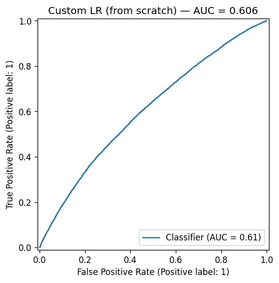
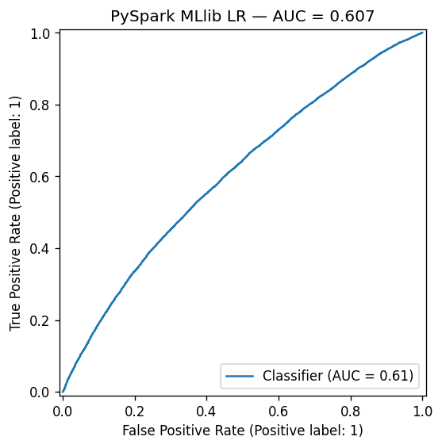

# US Flight Cancellations

Binary classification on the Kaggle [Airline Delay and Cancellation 2009-2018](https://www.kaggle.com/datasets/yuanyuwendymu/airline-delay-and-cancellation-data-2009-2018) dataset (~7 M scheduled US flights). Two model implementations on the same Spark-prepared features:

1. A **logistic regression hand-built from scratch** — sigmoid, log-loss, batch gradient descent with L2 regularization, all in NumPy.
2. **PySpark MLlib's `LogisticRegression`** as a sanity check against the hand-rolled implementation.

Originally a UNIMI dual-course final project ("Algorithms for Massive Datasets" + "Statistical Methods for Machine Learning"); refactored here into a modular pipeline as a portfolio piece.

## Results

The from-scratch LR and PySpark MLlib's `LogisticRegression` land within ~0.001 of each other on every metric — exactly the parity that motivates the comparison.

| Metric | Custom LR (NumPy) | MLlib LR | Δ |
| --- | --- | --- | --- |
| Accuracy | 0.5767 | 0.5750 | 0.0017 |
| Macro F1 | 0.5767 | 0.5749 | 0.0018 |
| ROC AUC | 0.6056 | 0.6068 | 0.0012 |

(Numbers from `python -m src.pipeline` on the 10% balanced subsample, seed `42`.)

| Model | ROC |
| --- | --- |
| From-scratch LR (NumPy) |  |
| PySpark MLlib LR |  |

Absolute performance is modest because the features are pre-departure-only (carrier, origin, destination, scheduled times, weekday/month) — no weather, no aircraft, no real-time ATC. The interesting part is the parity, not the headline AUC.

## Approach

- **PySpark for the heavy lifting.** Raw CSVs go straight into a SparkSession. Undersample the majority class, take a 10% slice, derive weekday + month from `FL_DATE`, `StringIndexer` on three categoricals (`OP_CARRIER`, `ORIGIN`, `DEST`), drop two correlated columns (`CRS_ARR_TIME`, `DISTANCE`), then `VectorAssembler` + `StandardScaler` via a Spark ML `Pipeline`.
- **From-scratch logistic regression.** The class lives in `src/logistic_regression.py` — `fit`, `predict`, `predict_proba`. Batch gradient descent on the log-loss with an L2 penalty whose gradient actually fires (the original notebook added the penalty to the *reported* loss but never to `dW`, so the lambda hyperparameter was a no-op). See "What I corrected" below.
- **Two-phase grid search** on the custom LR (matches the original notebook's approach): first sweep `learning_rate × n_iterations` with `lambda` fixed; then sweep `lambda` with the winners fixed.
- **MLlib comparison.** A second LR trained directly via `pyspark.ml.classification.LogisticRegression` on the same feature column. The README's ROC pair lets a reader eyeball whether the hand-rolled implementation is doing something reasonable, and the printed metrics quantify it.
- **Persistence.** Custom LR → joblib. MLlib model + fitted feature pipeline → Spark's native `.save()` (a directory each). Test arrays cached as `.npz` so `--evaluate` regenerates figures without needing Spark.

## What I corrected from the original notebook

Two small but real bugs:

1. **L2 regularization had no effect.** The original computed `penalty = lambda * sum(w**2)` and added it to the reported loss but the gradient update only used `(1/m) * X.T @ (y_hat - y)` — no `lambda` term. The hyperparameter grid over `lambda` was therefore busy-work; every value produced the same weights. The refactored class adds `(lambda / m) * w` to the gradient (standard textbook L2), and the unit test in `tests/test_logistic_regression.py::test_strong_regularization_shrinks_weights` confirms the weight norm actually shrinks now.
2. **Lambda grid-search loop used the wrong value.** The inner loop passed `lambda_value = k` (the loop index, `0` through `5`) instead of `lambda_value = lambda_values[k]`. The "best lambda" selection logic underneath was correct, so the reported best params were intact, but every fitted model along the way used a wrong lambda. Fixed by extracting one `grid_search` helper that takes explicit param dicts (no index lookup soup).

These are the kind of "I read the math, not just the API" callouts that the dual-course angle of this project earned.

## Repository layout

```
us-flight-cancellations/
├── data/                                # gitignored — Kaggle CSVs
├── models/                              # gitignored — joblib + Spark model dirs + test arrays cache
├── reports/figures/                     # tracked — ROC PNGs
├── src/
│   ├── config.py                        # paths, RNG seed, sample fraction, columns, search grids
│   ├── data.py                          # Spark session factory, raw loader, undersample
│   ├── features.py                      # date parts + Spark feature pipeline
│   ├── logistic_regression.py           # the hand-coded LR
│   ├── train.py                         # grid_search, two_phase_grid_search, MLlib fitter
│   ├── evaluate.py                      # metrics + ROC plotter
│   └── pipeline.py                      # train(), evaluate(), CLI
├── notebooks/
│   └── exploratory.ipynb                # single-year EDA: class imbalance, per-carrier rates
├── tests/
│   ├── test_logistic_regression.py      # convergence, regularization, predict_proba bounds
│   └── test_features.py                 # Spark pipeline shape check
├── requirements.txt
└── README.md
```

## Get the data

The original dataset isn't redistributed here. Download via the Kaggle CLI (or the web UI) and place the per-year CSVs directly in `data/`:

```bash
kaggle datasets download -d yuanyuwendymu/airline-delay-and-cancellation-data-2009-2018
unzip airline-delay-and-cancellation-data-2009-2018.zip -d data/
# Result: data/2009.csv, data/2010.csv, ..., data/2018.csv
```

## How to run

Prerequisites:

- Python 3.13.
- A JVM (PySpark requirement). On macOS: `brew install openjdk@17` and `export JAVA_HOME=$(/usr/libexec/java_home -v 17)`.

```bash
python3.13 -m venv .venv
source .venv/bin/activate
pip install -r requirements.txt

python -m src.pipeline             # train + evaluate (default)
python -m src.pipeline --train     # train only — persists artifacts + writes ROC PNGs
python -m src.pipeline --evaluate  # evaluate only — reloads cached test arrays + custom LR

pytest                              # 5 LR tests (no JVM) + 2 Spark tests (~5 s startup)
```

The full pipeline runs in ~5–10 minutes on a developer laptop: a couple of minutes for Spark to load + undersample + feature-pipeline the 7 M rows, then the bulk of the time is the two-phase grid search (30 custom-LR fits in phase 1, 6 in phase 2, on the collected 10% slice).

## Known limitations

- **10% subsample.** The original notebook downsamples to 10% after class balancing so the from-scratch numpy LR fits in driver memory. The MLlib model could go bigger but is held to the same slice for the comparison to be apples-to-apples.
- **Binary task only.** The dataset has a multi-class delay reason field; this project intentionally stays on the binary `CANCELLED` target.
- **No cross-validation.** Single `randomSplit(0.8, 0.2)` matches the original; not worth introducing CV without also expanding the data slice.

A follow-up "improve" pass could replace PySpark with Polars/DuckDB (much faster locally, no JVM), or swap the LR for a tree ensemble. Out of scope for this iteration.
